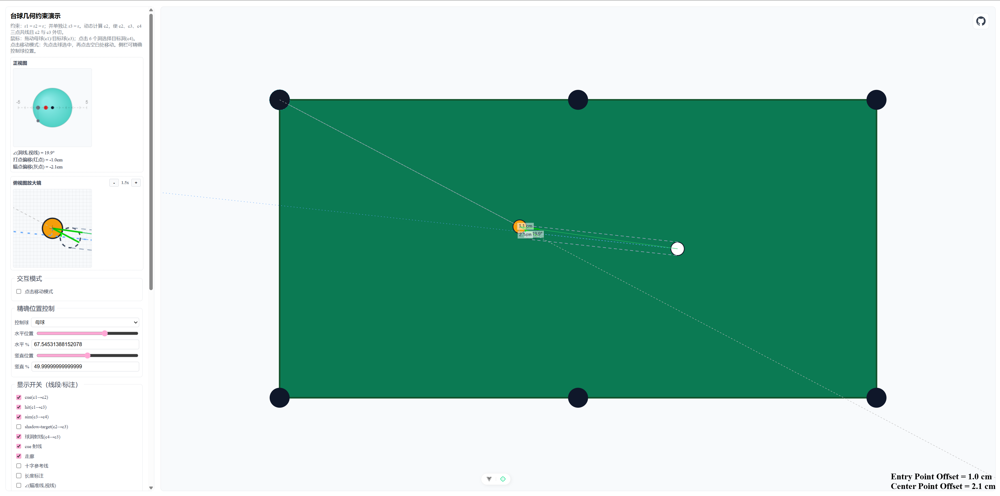

# 🎱 CueAimer - 台球几何约束演示工具

一个基于Vue 3的交互式台球瞄准几何演示工具，帮助理解台球运动中的几何关系和瞄准原理。

**[在线演示](https://vakesamahere.github.io/CueAimer/)**



## 功能特点

### 核心功能
- **实时几何计算**：动态计算母球、鬼球、目标球和球洞的几何关系
- **正视图分析**：提供正视图视角，显示瞄准偏移和角度信息
- **俯视图放大镜**：可缩放的俯视图，便于精确观察

### 可视化元素
- **走廊显示**：显示母球到鬼球的运动走廊
- **角度标注**：实时显示各种关键角度
- **偏移计算**：精确计算和显示瞄准偏移量
- **射线系统**：显示球杆射线、视线、球洞射线等

### 交互功能
- **拖拽操作**：直接拖拽母球和目标球调整位置
- **精确控制**：通过滑块和数值输入精确控制球的位置
- **球洞选择**：点击选择6个不同的目标球洞
- **显示开关**：可选择性显示/隐藏各种辅助线和标注

## 使用说明

### 基本操作

1. **移动球体**
   - 直接拖拽母球（白球）和目标球（黄球）
   - 或使用左侧面板的"精确位置控制"滑块

2. **选择目标洞**
   - 点击台面上的任意一个球洞（黑色圆圈）
   - 当前选中的球洞会显示蓝色虚线边框

3. **调整显示**
   - 使用"显示开关"控制各种辅助线的显示/隐藏
   - 调整"俯视图放大镜"的缩放级别查看细节

### 关键概念

- **母球(c1)**：白色球，击球的起点
- **鬼球(c2)**：虚线圆，表示母球击中目标球时的位置
- **目标球(c3)**：黄色球，要击打的目标
- **球洞(c4)**：黑色圆，目标球要进入的洞

### 正视图说明

正视图显示从瞄准线垂直方向观察的视角：
- **红点**：鬼球切点在瞄准线上的投影
- **灰点**：走廊中心线在瞄准线上的投影
- **边缘指示点**：灰点在目标球边缘的垂直投影（新功能）

## 快速开始

### 环境要求
- Node.js >= 18.12.0
- npm 或 yarn

### 安装步骤

1. **克隆项目**
```bash
git clone https://github.com/vakesamahere/CueAimer.git
cd CueAimer
```

2. **安装依赖**
```bash
npm install
```

3. **启动开发服务器**
```bash
npm run dev
```

4. **打开浏览器**
访问 `http://localhost:5173` 即可使用

### 构建部署

```bash
# 构建生产版本
npm run build

# 预览构建结果
npm run preview
```

## 许可证

本项目采用 MIT 许可证 - 查看 [LICENSE](LICENSE) 文件了解详情

---

⭐ 如果这个项目对您有帮助，请给个Star支持一下！
